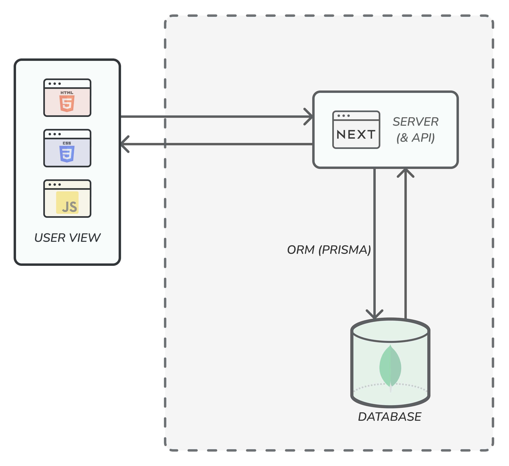
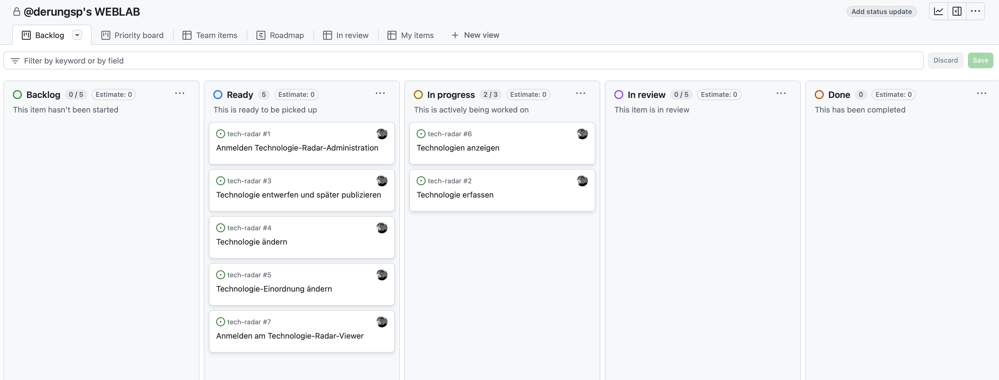
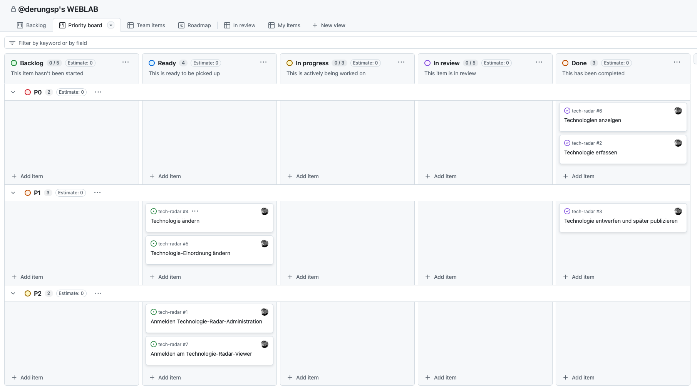
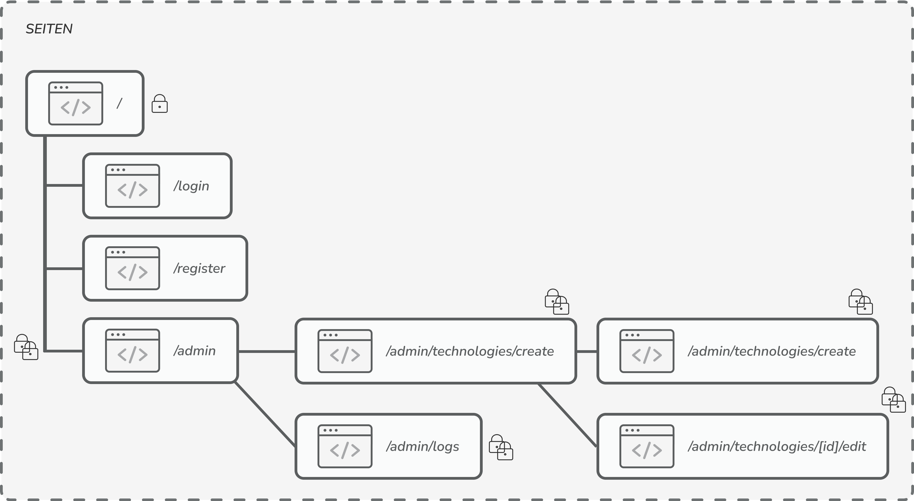
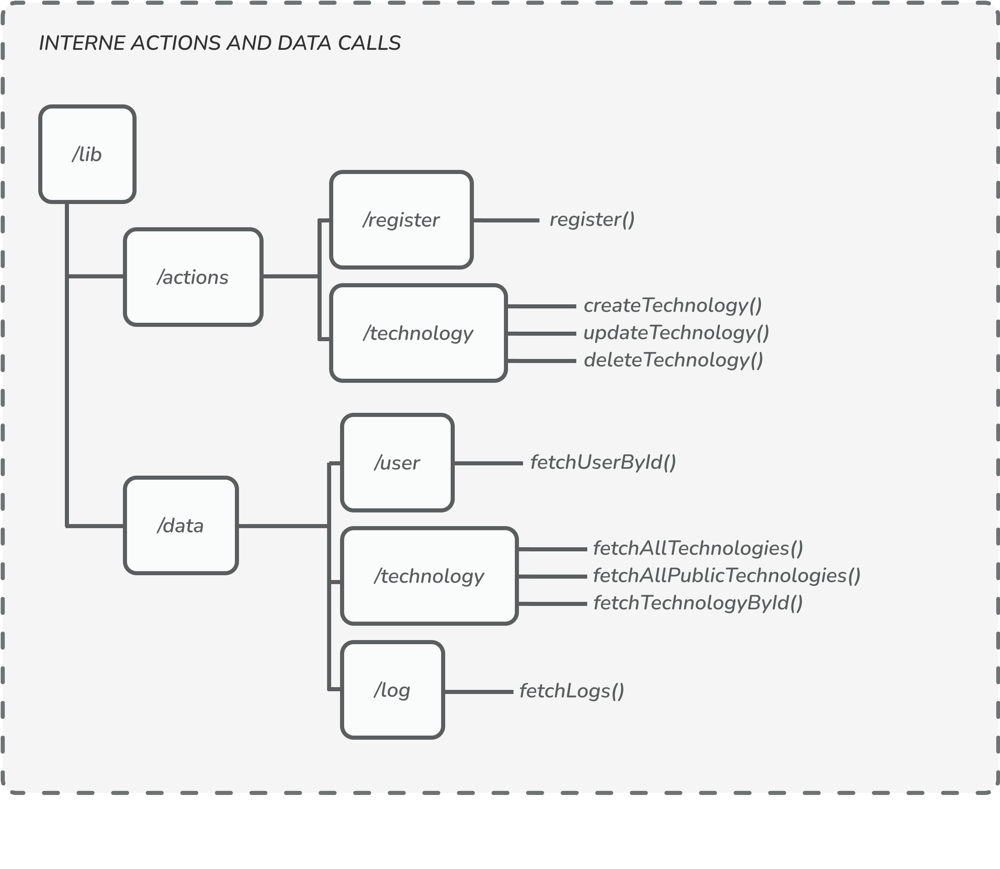

# Web Programming Lab (WEBLAB)

#### Pascal Derungs - HSLU Blockwoche HS24

Link zur produktiven Umgebung: [tech-radar-ten.vercel.app](https://tech-radar-ten.vercel.app)

# 1. Einführung und Ziele

Das Projekt im Modul Web Programming Lab ermöglicht es, die gelernten Inhalte aus dem Unterricht direkt anwenden zu können. Der Fokus des Projektes liegt auf die Anwendung von noch nicht bekannten Web Technologien.

## 1.1 Projektidee

Als Arbeit wird das präsentierte Projekt **"Technologie-Radar"** umgesetzt. Keine eigene Idee.

## 1.2 Organisatorisches

- Das Projekt wird in **Einzelarbeit** erarbeitet.
- Sie können eigene Projekt-Vorschläge bringen oder das vorgeschlagene Projekt "Technologie-Radar" umsetzen.
- Sie sollten **ca. 60h** in das Projekt investieren (Implementierung, Dokumentation, Präsentation).

## 1.3 Technologie-Stack

Anstatt Angular wird dieses Projekt mit **Next.js (React, Typescript)** mit App Router umgesetzt. Für die Persistenz wird **MongoDb** mit Prisma verwendet. Weiter werden diverse Libraries für Design, Validation etc. verwendet (Tailwindcss, zod, d3, framer motion, heroicons...).

## 1.4 Ggf. angedachte Abgrenzungen / Änderungen

Es wird versucht, die vorgegebenen Anforderungen zu erfüllen. Keine Änderungen.

## 1.5 Bewertung

Die Modulnote ergibt sich aus: Projekt-Ergebnisse (70%) und Projekt-Präsentation (30%).

_Hinweis: Verspätete Abgaben haben einen Notenabzug von 0.5 zur Folge. Abgaben die mehr als 24h später erfolgen führen zu einer Modulbewertung `F`_

### 1.5.1 Projekt-Ergebnisse

- Architekturdokumentation 35%
- Fazit & Reflexion 20%
- Arbeitsjournal 10%
- Softwareartefakte 35%

### 1.5.2 Präsentation

- Aufbau, Verständlichkeit 30%
- Präsentationsartefakte 60% (Abgabe nach der Präsentation, Inhalt für 5 Minuten)
- Einhaltung der Timebox 5 Minuten 10%

# 2. Randbedingungen

In der Art der Projektumsetzung besteht sehr viel Freiheit. Bedingungen, die aber bestehen sind folgende:

- Es soll eine Full-Stack-Webapplikation mit modernen Webframeworks entwickelt werden (Angular, React, Vue..)
- Es sollen CRUD-Operationen auf eine Datenbank ausgeführt werden.
- Die Anforderungen (Kapitel 2.) sollen erfüllt sein.

# 3. Kontext & Umfang

## 3.1 User Stories

In der folgenden Tabelle werden die Anforderungen kurz aufgelistet. Die detaillierten Informationen sind als GitHub-Issues zu finden (verlinkt in Tabelle).

| #   | Titel                                        | Link                                                            |
| --- | -------------------------------------------- | --------------------------------------------------------------- |
| 1   | Anmelden Technologie-Radar-Administration    | [User Story 1](https://github.com/derungsp/tech-radar/issues/1) |
| 2   | Technologie erfassen                         | [User Story 2](https://github.com/derungsp/tech-radar/issues/2) |
| 3   | Technologie entwerfen und später publizieren | [User Story 3](https://github.com/derungsp/tech-radar/issues/3) |
| 4   | Technologie ändern                           | [User Story 4](https://github.com/derungsp/tech-radar/issues/4) |
| 5   | Technologie-Einordnung ändern                | [User Story 5](https://github.com/derungsp/tech-radar/issues/5) |
| 6   | Technologien anzeigen                        | [User Story 6](https://github.com/derungsp/tech-radar/issues/6) |
| 7   | Anmelden am Technologie-Radar-Viewer         | [User Story 7](https://github.com/derungsp/tech-radar/issues/7) |

## 3.2 Kontext

Das folgende Diagramm zeigt eine Next.js 15 Architektur mit Server Side Rendering (SSR). Der Server rendert die Seiten, holt dafür Daten über Prisma aus der MongoDB-Datenbank und liefert das fertige HTML an den Client. Next.js nutzt ein intelligentes Caching, um wiederholte Anfragen schneller zu beantworten. Der Client zeigt die gerenderte Seite mit HTML, CSS und JavaScript an.



## 3.3 Projektvorgehen

Da das Projekt nur von einer Person entwickelt worden ist, fiel dieser Bereich einfach aus. Es wird mit mithilfe von GitHub die gesamte Applikation entwickelt und verwaltet. Das ermöglicht den Zugriff auf alle historischen Artifakte.

Weiter wurden Issues und Projects von GitHub verwendet, um die Projektanforderungen zu planen und abzuarbeiten. Diese Issues wurden erst auf einen Kanban-Board angeordnet:



Anschliessend wurden die einzelnen User-Stories priorisiert (must, should, could) und auf einem Prioritäten-Board dann für die Realisierung strukturiert:



# 4. Lösungsstrategie

Für die Entwicklung der Webanwendung fiel die Wahl auf **Next.js 15 mit App Router**, da es eine moderne Grundlage für performante Webanwendungen bietet. Durch **Server Side Rendering (SSR)** werden die Seiten direkt auf dem Server gerendert und als fertiges HTML an den Client ausgeliefert. Obwohl SSR beim initialen Laden tendenziell langsamer ist als Single Page Applications (SPAs) wie Angular, bietet Next.js mit seinem **intelligenten Caching** eine Lösung, die wiederholte Anfragen extrem schnell macht. Dies sorgt für eine hohe Performance, besonders bei dynamischen Inhalten und SEO-relevanten Seiten.

Für das Styling wird **Tailwindcss** verwendet, das dank seiner Utility-first-Klassen eine schnelle und flexible Gestaltung der Benutzeroberfläche ermöglicht. Ergänzt wird dies durch **Framer Motion** für flüssige Animationen.

Die Authentifizierung erfolgt mit **NextAuth**, wobei **Prisma** eine effiziente Integration mit der **MongoDB-Datenbank** sicherstellt. Prisma dient als ORM und ermöglicht eine performante und strukturierte Verwaltung der Daten. Zur sicheren Speicherung von Passwörtern kommt **bcrypt** zum Einsatz. Für die Validierung der Daten sorgt **zod**.

Zur Sicherstellung der Code-Qualität kommen ESLint, Prettier und Husky zum Einsatz. Diese Tools optimieren den Entwicklungsworkflow und verbessern die Code-Konsistenz. So ergibt sich ein modernen, skalierbarer Tech-Stack, der sowohl Performance als auch Sicherheit gewährleistet.

# 5. Bausteinschicht

In diesem Kapitel wird genauer auf die entwickelten Komponenten der Webapplikation eigegangen.

## 5.1 Frontend

Das folgende Diagramm zeigt alle Seiten der entwickelten Lösung. Die einzelnen Seiten sind teilweise mit Schlössern gekennzeichnet. Die Schlösser bedeuten:

- **Ein Schloss:** Die Seite steht nur für angemeldete Benutzer zur Verfügung.
- **Ein Schloss:** Die Seite steht nur für angemeldete Benutzer zur Verfügung, die die Rollen CTO oder TECHLEAD besitzen.

Nicht-authentifizierte Benutzer werden stets auf die Login-Seite weitergeleitet.



## 5.2 Backend

Im Backend stehen verschiedene Actions und Data calls zur Verfügung, die die CRUD-Operationen der Technologien implementieren. Best Practice von Next.js trennt alle schreibenden Aktionen von den Fetches und somit bestehen die zwei Verzeichnisse "actions" und "data".



## 5.3 Datenbank

Im folgenden Bild wird das Datenbankschema des Projekts gezeigt, welches sehr schlicht und ohne Beziehung gestaltet wurde. Technologien sind laut Anforderungen nicht an die User gebunden. Weiter gilt es zu erwähnen das mit den Prisma-Enum's "Ring" und "TechnologyCategory" gearbeitet wurde.


# 6. Softwareartefakte

Alle Softwareartefakte sind mit Historie in diesem [GitHub Repository](https://github.com/derungsp/tech-radar/) zu finden.

# 7. User Credentials

Um zu Demonstrationszwecken die Berechtigungen und Rollen zeigen zu können, wurden verschiedene Benutzer vorbereitet. Mit folgenden Credentials kann man sich auf der Webapplikation anmelden:

| Name            | Rolle     | Email                         | Passwort             |
| --------------- | --------- | ----------------------------- | -------------------- |
| Max Franz       | CTO       | maxfranz@tech-radar.ch        | hyxbib-waRmak-5zevqo |
| Stefanie Müller | Tech-Lead | stefaniemueller@tech-radar.ch | hyxbib-waRmak-5zevqo |
| Hans Meier      | Employee  | hansmeier@tech-radar.ch       | hyxbib-waRmak-5zevqo |

# 8. CI / CD

Auf GitHub wurde eine CI-Pipeline definiert, die das Projekt mit ESLint nochmals überprüft und alle definierten Tests ausführt. Das Code-Coverage-Protokoll wird als Artefakt mit dem Job abgespeichert.

Das Projekt wurde laufend und automatisch auf Vercel deployed. Vercel bietet die Eigenschaft, sich direkt mit GitHub zu verbinden und Deployments automatisch nach Commits durchzuführen. So erstellt Vercel auch automatisch Production-, Development-, und Preview-Builds, je nach Branch des Commits (main, etc.).

# 9. Risiken und technische Schulden

| Titel                            | Typ         | Beschreibung                                                                                                                                                             |
| -------------------------------- | ----------- | ------------------------------------------------------------------------------------------------------------------------------------------------------------------------ |
| Tech-Radar Überschneidungen      | Refactoring | Punkte im Tech-Radar werden zurzeit zufällig pro Ring gesetzt. D.h. die Punkte können sich überschneiden, was nicht schön ist.                                           |
| Usermanagement                   | Feature     | Ein Usermanagement direkt auf der Website erleichtert das Erstellen und Bearbeiten von Benutzern. Zurzeit kann nur wie Registrierung ein neuer Employee erstellt werden. |
| Mandatenfähigkeit                | Feature     | Ausweitung auf mehrere Mandate. Firmen können erstellt werden und Zugriffe bzw. Tech-Radars pro Firma.                                                                   |
| Redundanzen entfernen            | Refactoring | An gewissen Stellen im Projekt, gibt es Komponenten, die redundant bzw. sehr ähnlich mehrfach vorkommen. Diese kann man in einem weiteren Schritt zusammenfassen.        |
| Tooltip-Alternative für Mobile   | Feature     | Die Tooltip lassen sich natürlich nicht gut anzeigen auf einem Gerät mit Touchscreen. Eine Alternative wäre schön.                                                       |
| Redundanz bei Rollenberechtigung | Refactoring | Die Rollenüberprüfung findet momentan in den gesicherten Komponenten redundant statt und bildet so ein Risiko, wenn man es einheitlich bearbeiten möchte.                |

# 10. Fazit & Reflexion

Dieses Modul beziehungsweise die Projektarbeit hat mir sehr gut gefallen, da ich mich für diesen Bereich der Softwareentwicklung interessiere. Trotz vorhandener Erfahrungen mit Angular sowie anderen Technologien, konnte ich bei diversen Themen neue Aspekte mitnehmen, die mich auch zum Denken anregten.

Ich habe aus früheren Beschäftigungen schon viele Erfahrungen mit AngularJS und Angular2+ gemacht, sodass ich mich dazu entschieden habe, das Projekt "Tech-Radar" mit Next.js 15 umzusetzen. Etwas, das mich schon länger reizte. Da ich mit React, Typescript etc. schon vertraut war, ging die Realisierung ziemlich rund.

Vor allem konnte ich neues in Sachen Testing (mit Jest) lernen. Das fiel bei mir bisher sonst ziemlich schlank aus, da eher Frontend-Tests mit Selenium gemacht wurden.

Es war eine Challenge für mich, den Tech-Radar schön visuell anzuzeigen und ich finde es hat immer noch Verbesserungspotenzial. Insbesondere auf der Mobile-Ansicht. Dennoch konnte ich erste Erfahrungen mit d3.js machen und so alle Daten visuell in einem SVG für die Website bereitstellen.

# 11. Arbeitsjournal

| Datum             | Aufwand (h) | Titel                                                             | Beschreibung                                                                                                                                                                                                                                                                                                                                                                                                                                                                                                                                |
| ----------------- | ----------- | ----------------------------------------------------------------- | ------------------------------------------------------------------------------------------------------------------------------------------------------------------------------------------------------------------------------------------------------------------------------------------------------------------------------------------------------------------------------------------------------------------------------------------------------------------------------------------------------------------------------------------- |
| 03.02.2025        | 9           | Initialer Aufbau und Authentifikation                             | Next.js 15 (App Router) Projekt initialisiert und mittels NextAuth & MongoDb eine erste Authentifikation für User inkl. Rollen entwickelt. Für die serverseitige Validation wurde zod und als ORM wurde prisma verwendet. Als Entwicklungstools wurden ESLint / Prettier und husky ins Projekt eingebunden und konfiguriert.                                                                                                                                                                                                                |
| 04.02.2025        | 8           | Login / Register Seiten, Navbar, RadarChart und Hosting           | Es wurden eine Login und Register Seite sowie eine erste Navbar mithilfe von Tailwindcss, framer motion und heroicons entwickelt. Deployment auf Vercel wurde eingerichtet. Erste Versuche eines RadarCharts wurden gemacht.                                                                                                                                                                                                                                                                                                                |
| 05.02.2025        | 10          | Tech-Radar, Technology-Schema, CRUD-Funktionalitäten, Refactoring | Eine erste Version der Tech-Radars wurde entwickelt (Testdaten). Technologien werden auf der Übersichtsseite rollenbasiert angezeigt. Ausserdem können Technologien auf einer seperaten Seite erstellt und abgespeichert werden. Es wurde ein spezieller Select für die Enum's für den Ring und die Kategorie entwickelt. Dazu wurde headlessui eingebunden. Ganzes Projekt wurde überarbeitet und das Editieren sowie das Erstellen von Technologien fertiggestellt. Der Tech-Radar wurden mit Farben und konsistenter Legende verbessert. |
| 06.02.2025        | 7.5         | Abschluss aller Anforderungen, Refactorings, Doku                 | Alle Anforderungen wurden abgeschlossen. Diagramme des Projekts für die Doku erstellt und die ersten Teile geschrieben. Logger entwickelt, der alle Anmeldungen loggt und durch Tech-Leads und CTOs eingesehen werden kann. Design wurde grundlegend überarbeitet und responsive gemacht. Der Tech-Radar wurde verschönert und mit einer Liste und Tooltips versehen. RadixUI wurde eingebunden, um ein spezielles Accardion anzuzeigen (sah ich irgendwo mal als Idee).                                                                    |
| 07.02.2025        | 4.5         | Testing, GitHub CI, Refactorings, Dokumentation                   | Es wurde Jest eingebunden für das Testing der Backendlogik und die entsprechenden Tests erstellt. Es werden alle Methoden der Actions und Data Calls getestet und eine Codeabdeckungs-Prüfung gemacht. Ausserdem wurde eine GitHub CI erstellt, die den ESLint und alle Tests durchführt. Zum Schluss wurden noch grossflächig Refactorings am Design vorgenommen, damit alles auf jeden Bildschirmgrössen gut aussieht. Dokumentation wurde noch ergänzt.                                                                                  |
| **Total Aufwand** | 39          |                                                                   |

# Getting Started für die lokale Entwicklung

1. Sicherstellen, dass die Environment-Variablen vorhanden sind (.env).
2. Alle Abhängigkeiten installieren:

   ```bash
   npm install
   ```

3. Das Prisma-Schema lokal generieren:

   ```bash
   npx prisma generate
   ```

4. Projekt starten:
   ```bash
   npm run dev
   # or
   yarn dev
   # or
   pnpm dev
   # or
   bun dev
   ```
5. Webseite ist nun unter [http://localhost:3000](http://localhost:3000) erreichbar.

Weitere hilfreiche Befehle:

1. Projektbuild erstellen:
   ```bash
   npm run build
   ```
2. ESLint laufen lassen:

   ```bash
   npm run lint
   ```

3. Husky im Projekt registrieren für pre-commit Action:
   ```bash
   npm run prepare
   ```
4. Mit Prettier das ganze Projekt formatieren:
   ```bash
   npm run format
   ```
5. Das Prisma-Schema an die DB pushen:

   ```bash
   npm run db:push
   ```
